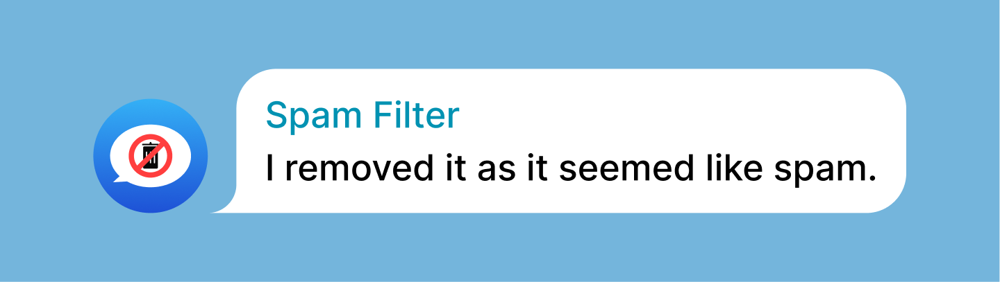

# @spam_filter_robot — bot for filtering spam messages in Telegram chats

Welcome to Telegram Spam Filter Bot! This project aims to provide a robust solution for detecting spam messages within Telegram groups. By utilizing TF-IDF vectorizer and a comprehensive database of sample spam messages, this bot effectively identifies and filters out spam, ensuring a cleaner and more enjoyable group chatting experience.

> **Help Wanted**: We are looking for contributors to help improve the bot's spam detection accuracy and add new features. If you are interested in contributing, please check out the [Contributing](#contributing) section below.

## Mission

Our mission is to protect users from scammers and maintain a clean chat space within Telegram groups by leveraging advanced natural language processing techniques.

## Features

- **Spam Detection**: Utilizes TF-IDF vectorizer to accurately identify spam messages.
- **Comprehensive Database**: Includes a vast database of sample spam messages for improved detection accuracy.
- **Real-time Filtering**: Filters out spam messages in real-time, ensuring a spam-free environment for group members.
- **User-friendly Interface**: Offers a seamless and intuitive user experience for admins to report spam messages.

## Bot Usage 

1. Add the bot to your group.
2. Grant the bot admin privileges for deleting messages.
3. The bot will automatically start filtering spam messages in the group.
4. If you want to report a message as spam, simply reply to the message with `/spam`.

## How to Run Locally

To run the Telegram Spam Detector Bot locally, follow these steps:

1. Clone this repository:

```bash
git clone https://github.com/talyguryn/antispambot.git
```

2. Copy `.env.example` to `.env` and replace the values with your own:

```bash
cp .env.example .env
```

3. Obtain a Telegram Bot API token from [BotFather](https://t.me/botfather) and replace `BOT_TOKEN` in `.env` with your token.

4. Also replace `ADMIN_CHAT_ID` with your Telegram user ID to get report messages. You can get your user ID by sending `/id` to [userinfobot](https://t.me/userinfobot).

5. Install dependencies and run the bot:

```bash
yarn install
yarn start
```

You can also use Docker via docker-compose to run the bot in a containerized environment.

```bash
docker-compose up
```

6. Start using the bot in your Telegram group!

## Contributing

Contributions are welcome! If you have any ideas, bug fixes, or improvements, feel free to open an issue or submit a pull request.